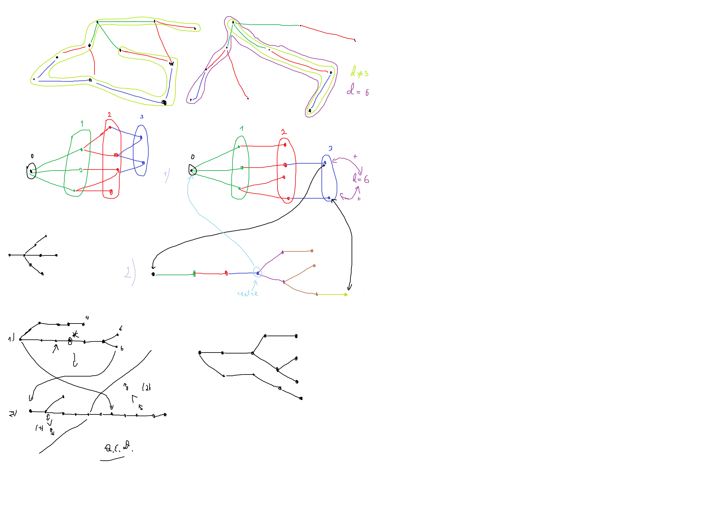

# Algorithms 4th edition, solutions
This repo contains my solutions to [Algorithms, 4th edition](https://algs4.cs.princeton.edu/home/) 2-semester course by prof. Robert Sedgewick, Princeton University that I took in 2020.

Each directory is a standalone project whilst a lot of them might contain a couple of projects on a similar topic.

There is also a special folder called [Algorithms](Algorithms) that contains the fully formalised answers to each week's quizes, tests and projects, with explanations, colourful proofs, source code samples and the compiled binaries.
It's divided into 2 folders for each semester:
- [Algorithms Part 1](Algorithms/Algorithms%20Part%201)
- [Algorithms Part 2](Algorithms/Algorithms%20Part%202)

## Examples of prooofs and illustrations in this repo
Perfect matchings in k-regular bipartite graphs

Undirected graph diameter search

---
All rights for the Java libraries and task ideas belong to their creators and [Princeton University](https://algs4.cs.princeton.edu/home/).